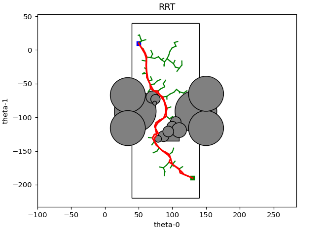

# 2-joint robotic arm path planning simulator

This project was created to simulate a movement of a 2-joint robotic arm.
It uses RRT (Rapidly exploring random tree) algorithm in order to find a smooth path between limits and obstacles.

### example of path finding between two points:

This algorithm was implemented later on the 2023 FRC Robot of team #3075
here's the robot performences: https://www.youtube.com/watch?v=BuZPN2vgV44
